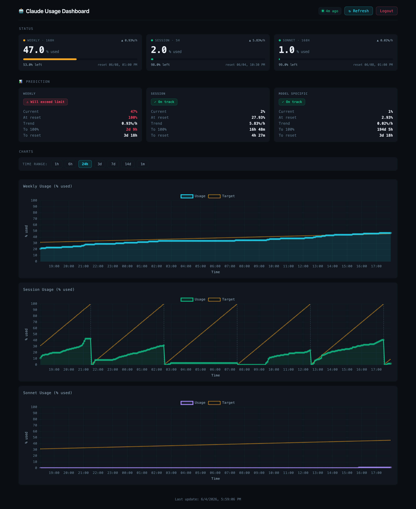

# Claude Usage Dashboard

[](https://github.com/robsonek/claude-usage-dashboard/actions/workflows/tests.yml)
[](https://github.com/robsonek/claude-usage-dashboard/actions/workflows/secret-scan.yml)

Web dashboard for monitoring Claude Code CLI usage with charts and prediction.



## Deployment Guide

### Overview

This document describes the deployment process for Claude Usage Dashboard
on a Linux server. Examples use Debian 13 (Trixie) but any modern Linux
distribution with Python 3.11+ works.

## Prerequisites

- Linux server with root/sudo access (tested on Debian 13 / Trixie)
- SSH access to the server
- Python 3.11+ with `venv`
- Git
- Claude Code CLI (`curl -fsSL https://claude.ai/install.sh | bash`) - after installation run `claude` to authenticate

## Deployment Steps

### 1. Clone Repository

```bash
ssh user@server
cd ~
git clone https://github.com/robsonek/claude-usage-dashboard.git claude-dashboard
cd claude-dashboard
```

### 2. Install System Dependencies

```bash
sudo apt update
sudo apt install -y python3.13-venv nginx git
```

### 3. Create Python Virtual Environment

```bash
cd ~/claude-dashboard
python3 -m venv venv
source venv/bin/activate
pip install --upgrade pip
pip install -r requirements.txt
```

### 4. Create Systemd Service

Create `/etc/systemd/system/claude-dashboard.service`:

```ini
[Unit]
Description=Claude Usage Dashboard
After=network.target

[Service]
Type=simple
User=YOUR_USERNAME
WorkingDirectory=/home/YOUR_USERNAME/claude-dashboard
Environment=PATH=/home/YOUR_USERNAME/claude-dashboard/venv/bin:/usr/bin
EnvironmentFile=/home/YOUR_USERNAME/claude-dashboard/.env
ExecStart=/home/YOUR_USERNAME/claude-dashboard/venv/bin/gunicorn --bind 127.0.0.1:5050 --workers 2 app:app
Restart=always
RestartSec=5

[Install]
WantedBy=multi-user.target
```

> **Required before first start:** the dashboard *fails closed* and will refuse
> to boot until `FLASK_SECRET_KEY` and `DASHBOARD_PASSWORD` are provided — via the
> `EnvironmentFile` above (a `.env` of `KEY=value` lines) or `Environment=` lines.
> See [Configuration](#configuration). If gunicorn keeps restarting right after
> deploy, this is almost always the cause (`journalctl -u claude-dashboard -e`
> shows `RuntimeError: Refusing to start ...`).

Enable and start the service:

```bash
sudo systemctl daemon-reload
sudo systemctl enable claude-dashboard
sudo systemctl start claude-dashboard
sudo systemctl status claude-dashboard
```

### 5. Configure Nginx Reverse Proxy

Create `/etc/nginx/sites-available/claude-dashboard`:

```nginx
server {
    listen 80;
    server_name _;

    location / {
        proxy_pass http://127.0.0.1:5050;
        proxy_set_header Host $host;
        proxy_set_header X-Real-IP $remote_addr;
        proxy_set_header X-Forwarded-For $proxy_add_x_forwarded_for;
        proxy_set_header X-Forwarded-Proto $scheme;
    }
}
```

Enable the configuration:

```bash
sudo ln -sf /etc/nginx/sites-available/claude-dashboard /etc/nginx/sites-enabled/
sudo rm -f /etc/nginx/sites-enabled/default
sudo nginx -t
sudo systemctl reload nginx
```

### 6. Install Cron and Configure Data Collection

Install cron daemon:

```bash
sudo apt install -y cron
sudo systemctl enable cron
sudo systemctl start cron
```

Set up cron job to collect data every 5 minutes:

```bash
crontab -e
```

Add the following lines at the end:

```cron
PATH=/home/YOUR_USERNAME/.local/bin:/usr/local/bin:/usr/bin:/bin
*/5 * * * * cd /home/YOUR_USERNAME/claude-dashboard && ./collect_history.sh >> /home/YOUR_USERNAME/claude-dashboard/cron.log 2>&1
```

Verify cron is set:

```bash
crontab -l
```

### 7. Verify Installation

```bash
curl -I http://localhost/
```

Expected response: HTTP 302 redirect to login page.

## Configuration

The app reads configuration from environment variables. It does **not** parse
`.env` files itself, so hand them to the gunicorn process either with
`Environment=KEY=value` lines under `[Service]`, or by pointing the unit at an env
file (`EnvironmentFile=/home/YOUR_USERNAME/claude-dashboard/.env`, see step 4)
containing `KEY=value` lines — no `export`, no quotes needed.

> **Fail-closed:** the dashboard refuses to start unless **both**
> `FLASK_SECRET_KEY` and `DASHBOARD_PASSWORD` are set — otherwise it would run on
> the built-in defaults and anyone could forge a logged-in session. For a throwaway
> local run only, set `ALLOW_DEFAULT_CREDENTIALS=1` to bypass the guard.

| Variable | Description | Default |
|----------|-------------|---------|
| FLASK_SECRET_KEY | Session signing key — **required** | (refuses to start) |
| DASHBOARD_PASSWORD | Login password — **required** | (refuses to start) |
| DASHBOARD_USERNAME | Login username | admin |
| SESSION_COOKIE_SECURE | Set to `1` when served over HTTPS (Secure cookie) | 0 |
| ALLOW_DEFAULT_CREDENTIALS | Set to `1` to allow built-in defaults (local dev only) | unset |
| CLAUDE_BIN | Path to Claude CLI | claude |
| RETENTION_DAYS | Days of history to keep; older snapshots/quotas, `data/YYYY-MM-DD/` dirs and `data/raw_debug/` files are pruned daily (the dashboard only charts up to 1 month) | 60 |

Generate a secure secret key with:

```bash
python3 -c 'import secrets; print(secrets.token_hex(32))'
```

After changing any variable, restart the service:
`sudo systemctl restart claude-dashboard`.

### Data retention

`collect_history.sh` runs `cleanup_old_data.py` at most once per day (gated by a
`data/.cleanup_done` date marker). It deletes snapshots+quotas older than
`RETENTION_DAYS`, removes `data/YYYY-MM-DD/` JSON dirs and `data/raw_debug/`
files past the same window, and `VACUUM`s the database only when rows were
removed. Run it manually anytime, and use `--dry-run` to preview:

```bash
venv/bin/python cleanup_old_data.py --dry-run
```

## Upgrading an Existing Deployment

The `quotas.period_start_at` column is added automatically on app startup,
but historical rows are left at NULL. Without backfill, the chart's Target
line and reset markers will only render correctly for snapshots captured
*after* the upgrade. Run the one-shot backfill once to populate older rows
(it also repairs the occasional +24h reset-time glitch some Claude CLI
versions emit at a reset boundary) using the same shift-vs-reset heuristic as
live inserts:

```bash
cd ~/claude-dashboard
venv/bin/python -c '
from database import UsageDatabase
import config
db = UsageDatabase(config.DB_FILE)
r = db.backfill_period_start_at()
print(f"period_start updated: {r[\"period_start_updates\"]}, "
      f"resets_at sanitized: {r[\"resets_at_sanitized\"]}")
'
```

The pass is idempotent — re-running it is a no-op once everything is
consistent. Back up `usage.db` first if the deployment carries data you
cannot afford to lose.

## Management Commands

```bash
# Check service status
sudo systemctl status claude-dashboard

# View logs
sudo journalctl -u claude-dashboard -f

# Restart service
sudo systemctl restart claude-dashboard

# Stop service
sudo systemctl stop claude-dashboard
```

## Claude CLI Authentication

IMPORTANT: The data collection requires Claude CLI to be logged in on the server.

After deployment, SSH into the server and authenticate:

```bash
ssh user@server
claude
```

Follow the OAuth flow to authenticate with your Anthropic account.
The CLI stores credentials in `~/.claude/` directory.

Without authentication, the dashboard will show empty quota data.

## Security Recommendations

1. Set a strong `DASHBOARD_PASSWORD` and `FLASK_SECRET_KEY` before the first start — the app fails closed and refuses to run on the built-in defaults (see [Configuration](#configuration))
2. Configure HTTPS with Let's Encrypt (certbot)
3. Set up firewall rules (ufw or iptables)
4. Restrict SSH access

## Troubleshooting

### Service won't start
- Check logs: `sudo journalctl -u claude-dashboard -e`
- Verify venv path exists
- Check file permissions

### 502 Bad Gateway
- Verify gunicorn is running: `sudo systemctl status claude-dashboard`
- Check if port 5050 is in use: `ss -tlnp | grep 5050`

### Database errors
- Ensure write permissions on working directory
- Check disk space: `df -h`

### Dashboard shows empty quotas
Typical causes and how to diagnose:

1. Claude CLI not authenticated on the server — run `claude` manually and
   complete the OAuth flow.
2. `claude` binary not in the cron job's PATH — verify the `PATH=...`
   line in `crontab -l`.
3. Claude CLI UI changed — run the fetcher by hand with debug output:

   ```bash
   cd ~/claude-dashboard
   DEBUG_USAGE_FETCHER=1 venv/bin/python usage_fetcher.py
   ```

   The collector (`collect_history.sh`) now also logs `WARN: empty quotas`
   or `WARN: fetcher returned error: ...` straight into `cron.log` when
   something goes wrong — check it first:

   ```bash
   tail -n 50 ~/claude-dashboard/cron.log
   ```

   On a hard fetcher error the collector also **exits non-zero** (so a systemd
   timer / monitoring sees the failure instead of a misleading success), and it
   saves the raw PTY bytes + emulated text of any incomplete/glitched reading
   under `data/raw_debug/` — inspect those to see exactly what the parser was
   fed when a quota row goes missing after a Claude CLI update.

### `cron.log` grows indefinitely
Add a logrotate rule at `/etc/logrotate.d/claude-dashboard`:

```
/home/YOUR_USERNAME/claude-dashboard/cron.log {
    weekly
    rotate 4
    compress
    missingok
    notifempty
    copytruncate
}
```

Or truncate manually from time to time: `: > ~/claude-dashboard/cron.log`.

---
Deployment completed successfully.
